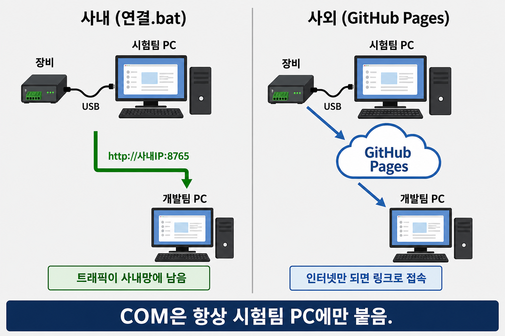
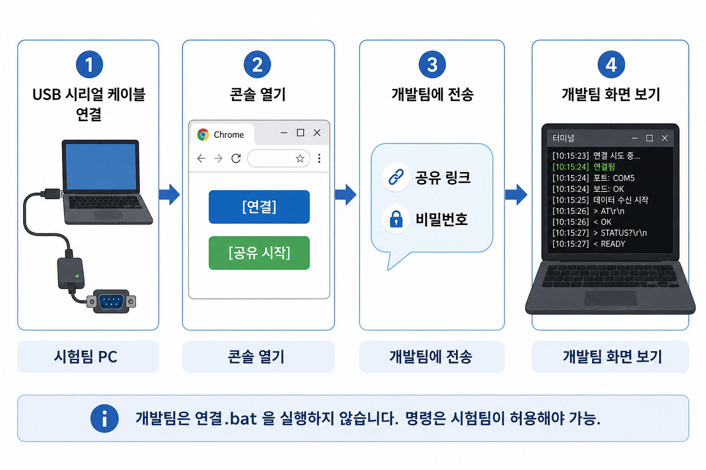
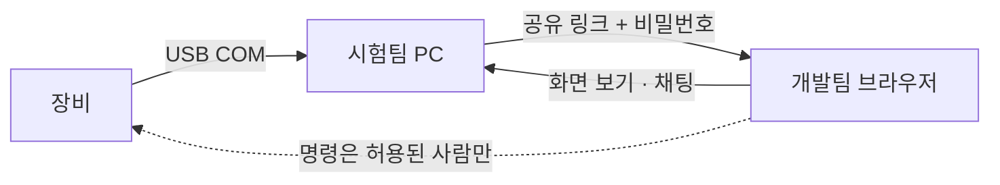

# 웹 시리얼 콘솔

Chrome / Edge 에서 장비 COM 을 여는 Tera Term 스타일 화면입니다.

**COM 은 항상 시험팀 PC 에만 붙습니다.** 개발팀은 링크만 받아 같은 화면을 봅니다.

공식 주소: [https://zero8711.github.io/mcr-web-console/](https://zero8711.github.io/mcr-web-console/)

브라우저: **Chrome 또는 Edge**. Firefox, Safari, `file://` 는 안 됩니다.

---

## 어디에 쓰나요

| 장소 | 시험팀 | 개발팀 |
|------|--------|--------|
| **사내** | `mcr_console.bat` 실행 → `http://127.0.0.1:8765/` | 시험팀이 준 **사내 IP:8765** 링크 |
| **사외 / 출장** | 위 공식 주소에서 [공유 시작] | 시험팀이 준 **GitHub 공유 링크** |

사내에서도 GitHub 링크만 쓸 수는 있습니다. 다만 회사망이 P2P 를 막으면 접속이 실패하거나, 콘솔 내용이 사외 중계를 탈 수 있습니다. 사내 로그를 망 안에 두려면 `mcr_console.bat` 을 쓰세요.

---

## 누가 무엇을 하나요

- 시험팀: 케이블이 꽂힌 PC. COM 연결, 공유, 이상로그 감시, 명령 허용.
- 개발팀: `mcr_console.bat` 을 실행하지 않습니다. COM 도 고르지 않습니다. 받은 링크만 엽니다.

---

## 시험팀

### 사내 (`mcr_console.bat`)

1. `mcr_console.bat` 을 실행합니다. **검은 창은 닫지 마세요.**
2. Chrome 이 `http://127.0.0.1:8765/` 로 열립니다. **이 주소에서만** COM 을 연결하세요.
3. [연결] → 장비 COM 을 고릅니다. Tera Term 이 같은 COM 을 잡고 있으면 먼저 종료하세요.
4. 장비가 여러 대면 [콘솔 추가] 후 칸을 클릭하고 다시 [연결] 합니다. 최대 4대, 공유 링크는 1개입니다.
5. 이름과 공유 비밀번호를 넣고 [공유 시작] 합니다.  
   비밀번호: 영문 + 숫자 + 특수문자, 8자 이상.
6. [링크 복사] 한 주소와 비밀번호를 개발팀에 보냅니다. 링크만으로는 방에 못 들어갑니다.
7. 끝나면 [공유 종료]. 탭이나 `mcr_console.bat` 창을 닫아도 공유가 끊깁니다.

다른 PC 에서 페이지 자체가 안 열리면 시험팀 PC 방화벽에서 TCP **8765** 인바운드를 허용하세요.

시험팀이 ipTIME 뒤에 있고 개발팀이 그 LAN 이 아니면, [공유기 사내 IP] 에 **공유기가 사내망에서 받은 주소**를 적고 TCP 8765 를 이 PC 로 포워드하세요. 노트북 IP(`192.168.50.x` 등)가 아닙니다.

### 사외 (GitHub Pages)

1. [https://zero8711.github.io/mcr-web-console/](https://zero8711.github.io/mcr-web-console/) 를 엽니다.
2. [연결] 로 COM 을 연 뒤, 이름·비밀번호 → [공유 시작].
3. 나온 공유 링크와 비밀번호를 보냅니다. 개발팀은 `mcr_console.bat` 이 필요 없습니다.
4. **이 탭을 닫으면 공유가 끊깁니다.**

Custom domain / CNAME 은 넣지 마세요.

---

## 개발팀

1. `mcr_console.bat` 을 실행하지 않습니다.
2. 받은 링크를 Chrome / Edge 로 엽니다.
3. 이름과 **시험팀에게 받은 비밀번호**를 넣고 [접속] 합니다.
4. 처음에는 **화면 보기와 채팅만** 됩니다. 장비 명령은 시험팀이 [접속자 명령 허용] 에서 켠 사람만 가능합니다.
5. 이상로그가 뜨면 목록·팝업이 원격에도 보입니다. 시험팀이 채팅에 떨어뜨린 로그 파일은 [다운로드] 로 받습니다.

상태가 초록(공유 접속됨)이 될 때까지 기다리세요.

---

## 자주 쓰는 기능

| 기능 | 설명 |
|------|------|
| 빠른 명령 | `ifconfig`, `logread` 등. 선택한 칸으로 보냅니다. |
| 이상로그 감시 | 시험팀이 키워드를 넣고 켭니다. 맞으면 위·아래 200줄을 파일로 저장하고, 횟수·마지막 시각이 쌓입니다. |
| 채팅 파일 | 저장된 `.log` 를 채팅창에 끌어다 놓으면 원격이 받을 수 있습니다. (약 450KB 이하) |
| 찾기 | 콘솔 칸에서 Ctrl+F. |
| 로그 저장 | 칸마다 Tera Term 식 세션 로그. 이상로그 감시와 별개입니다. |

시리얼 기본값: Baud **115200**, 8N1, 개행 **CR**. 장비가 반응하지 않으면 개행을 LF 또는 CR+LF 로 바꿔 보세요.

---

## 안 될 때

**공유 링크가 안 열림**

- 시험팀 탭과 (`mcr_console.bat` 을 썼다면) 검은 창이 아직 열려 있는지 확인합니다.
- 사내: 링크가 `http://사내IP:8765/...` 인지 봅니다. Pages `github.io` 링크는 사내 전용이 아닙니다.
- 사외: 회사망이 WebRTC 를 막으면 Pages 공유가 실패할 수 있습니다. 그때는 `mcr_console.bat` + VPN 을 씁니다.

**COM 이 안 열림**

- Chrome / Edge 의 `https://` 또는 `http://127.0.0.1` 인지 확인합니다.
- 같은 COM 을 Tera Term 이 잡고 있으면 종료합니다.

**비밀번호**

- 5번 틀리면 그 브라우저만 1분 동안 다시 넣을 수 없습니다. 다른 사람·시험팀은 그대로입니다.

---

## 관리자 참고

- 저장소를 Private 로 바꾸면 무료 계정에서는 Pages 가 내려갑니다. 다시 Public 으로 해도 Settings → Pages 에서 `main` / `/ (root)` 를 다시 켜야 합니다.
- 사내 IIS 에 `index.html`, `join.html`, `src/`, `vendor/` 만 올리면 COM 화면은 됩니다. 공유는 여전히 `mcr_console.bat` 입니다.
- `mcr_console.bat` 의 C# 을 바꾼 뒤에는 창을 닫고 다시 실행하세요.
